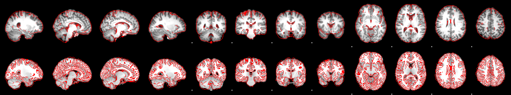

# Instructions for running first-level analysis

First level analysis processes the functional images for each subject.

## Files that are needed to run a first level analsyis are

* design_run1.fsf     
* design_run2.fsf
* congruent_run1.txt  
* congruent_run2.txt
* incongruent_run1.txt 
* incongruent_run2.txt

## The first level analyses are run in two steps.

1. Run `<make_FSL_Timings.sh>` to create the onset timing files
   (e.g., congruent_run1.txt and incongruent_run1.txt for run 1).

   That will convert the BIDS format timings to FSL format.

1. Run `<run_1stLevel_Analysis.sh>` to run all subjects's first level
   analysis.

The Registation of the high resolution to standard image should look something
like this.

If there are substantial red lines outside of the brain, then there may
be problems, and you should flag the subject for review.

